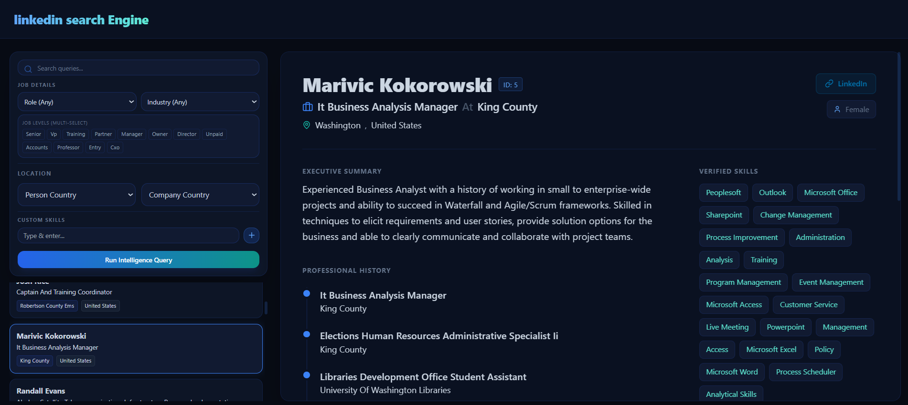

# موتور جستجوی پروفایل‌های لینکدین

## توضیحات کلی پروژه
با سلام خدمت تیم سایبریان. روند کلی داده در پروژه به این شکل هست که کوئری از سمت فرانتند به بکند میاد و توسط بکند پردازش میشه و الاستیک سرچ آیدی رکورد مورد نظر رو پیدا میکنه و اطلاعات رو از پستگرس میگیره و به بکند میده و بکند دوباره به فرانت بر میگردونه و نمایش داده میشه.

بکند با فست ای پی ای و فرانت با ری اکت توسعه داده شده است.

برای حفظ بهتر ساختار داده ها و همچنین بهره بردن از پستگرس و برای سرچ قوی تر از الاستیک سرچ استفاده شده و ترکیب این دو سرعت و فدرت قابل توجهی به پروژه داده.

در تمام کد ها سعی کردم ویژگی مقیاس پذیری رو حفظ کنم و ساختار رو طوری طراحی کردم که قابلیت توسعه داشته باشه.

دیتای یوزر ها پاکسازی شده و بصورت جیسون توی پوشه دیتا هست. کلا 303 رکورد وجود داشت.

ساختار کلی دیتا بیس توی فایل 01-init-db.sql هست.

در پوشه اسکریپتز تو اسکریپت داریم که یکی برای اینجست دیتا توی پست گرس هست و دیگری برای الاستیک سرچ.

فرانت هم با ریکت به بهترین و زیبا ترین شکل پیاده شده است.

اکثر تابع ها دیسکریپشن دارند و جاهایی که کد پیچیده شده یا نیاز به توضیح داد کامنت گذاری شده است و کد خوانا نوشته شده است.

پروژه روی آدرس زیر فعال میشود:
https://127.0.0.1:3000

ساختار پروژه به این شکل هست:
## ساختار پروژه
```text
linkedin_search_engine/
├── backend/
│   ├── api/
│   │   └── search.py
│   ├── core/
│   │   ├── config.py
│   │   ├── database.py
│   │   └── elasticsearch.py
│   ├── schemas/
│   │   └── user.py
│   ├── services/
│   │   └── search_service.py
│   └── main.py
├── data/
│   └── data.json
├── frontend/
│   ├── src/
│   │   ├── components/
│   │   │   └── FilterSelect.jsx
│   │   ├── App.jsx
│   │   └── main.jsx
│   ├── Dockerfile
│   ├── index.css
│   ├── index.html
│   ├── nginx.conf
│   ├── package.json
│   ├── postcss.config.js
│   └── tailwind.config.js
├── init-scripts/
│   └── 01-init-db.sql
├── scripts/
│   ├── ingest.py
│   └── ingest_elasticsearch.py
├── .env
├── .gitignore
├── docker-compose.yml
├── Dockerfile
├── Dockerfile.elasticsearch
└── requirements.txt
```

## نحوه اجرا
برای سادگی اجرا از داکر استفاده شده و شما میتونید با پول کردن پروژه و خارج کردن از فایل زیپ  با یک دستور پروژه رو ران کنید:

اول:

```bash
cd linkedin_search_engine
```

سپس فایل env را بسازید:
```bash
cp .env.example .env
```


بعد پروژه را اچرا کنید:
```bash
docker compose up --build
```

حالا این ادرس را مشاهده کنید:
https://127.0.0.1:3000


## توضیحات سرچ
سرچ روی فول نیم ها ، جاب تایتل ها نام شرکت ها و خلاصه ها انجام میشود.به ترتیب وزن سرچ روی فول نیم ها بیشتر است و با رسیدن به خلاصه بصورت نزولی کاهش میابد.از روش های نوین برای سرچ مانند فونوتیک و ... استفاده شده تا غلط املایی ها و سایر مشکلات پوشش داده شوند. فیلتر ها هم روی جاب تایتل لول ها و لوکیشن شرکت ها وانسان ها و نقش آنها تنظی شده است. برای همه فیلتر ها میتوان فیلد مورد نظر را انتخاب کرد ولی برای اسکیل بدلیل ازدیاد اسکیل ها کاربر میتواند متن خود را تایپ کرده و یک فیلتر اضافه کند. در کل سرچ فول تکست روی 3 چیز اجرا میگردد و 6 فیلتر داریم.

### تصویر پروژه

